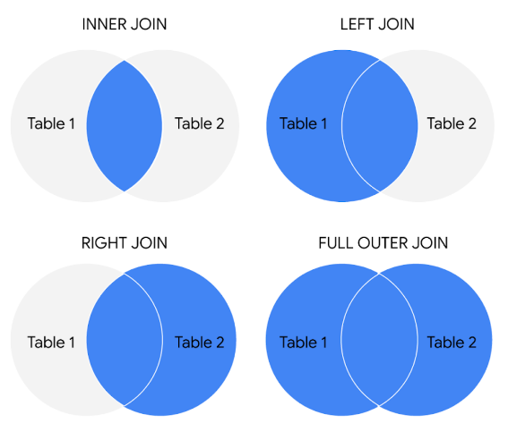

# 주요 데이터 애널리스트 도구

## 스프레드시트
데이터 애널리스트는 스프레드시트를 사용해 데이터를 수집하고 정리합니다. 데이터 애널리스트로서 앞으로의 역할에서 많이 사용하게 될 두 가지 인기 있는 스프레드시트 애플리케이션은 Microsoft Excel과 Google 스프레드시트입니다. 

스프레드시트는 다음과 같은 기능을 통해 의미 있는 방식으로 데이터를 구조화합니다 

- 정보 수집, 저장, 정리 및 정렬
- 패턴을 파악하고 각 특정 데이터 프로젝트에 적합한 방식으로 데이터를 조합합니다
- 그래프와 차트와 같은 뛰어난 데이터 시각화를 만들 수 있습니다. 

## 데이터베이스 및 쿼리 언어
데이터베이스는 컴퓨터 시스템에 저장된 구조화된 데이터의 모음입니다. 널리 사용되는 구조적 쿼리 언어(SQL) 프로그램으로는 MySQL, Microsoft SQL Server, BigQuery 등이 있습니다.

쿼리 언어 

- 분석가가 데이터베이스에서 특정 정보를 분리할 수 있게 해줍니다
- 데이터베이스에 대한 요청을 더 쉽게 배우고 이해할 수 있도록 지원
- 분석가가 분석을 위해 데이터베이스에서 데이터를 선택, 생성, 추가 또는 다운로드할 수 있도록 지원

## 시각화 도구
데이터 분석가는 그래프, 맵, 테이블, 차트 등 다양한 데이터 시각화 도구를 사용합니다. 두 가지 인기 있는 시각화 도구는 Tableau와 Looker입니다.

이러한 도구 

- 복잡한 숫자를 사람들이 이해할 수 있는 스토리로 바꾸기 
- 이해관계자가 정보에 입각한 의사 결정과 효과적인 비즈니스 전략으로 이어지는 결론을 도출할 수 있도록 지원  
- 다양한 기능 제공 

     - Tableau의 간단한 끌어서 놓기 기능을 통해 사용자는 대시보드에서 대화형 그래프와 워크시트 도구에 바로 연결할 수 있습니다.

    - Looker는 데이터베이스와 직접 통신하므로 데이터를 시각화에 바로 연결할 수 있습니다 

데이터 애널리스트로서의 경력에는 통계학 분석, 시각화 및 기타 데이터 분석에 많이 사용되는 R 및 Python과 같은 프로그래밍 언어 사용도 포함됩니다.

---

# 작업에 적합한 도구 선택하기
데이터 애널리스트는 일반적으로 작업 중인 특정 프로젝트에 어떤 프로그램이나 솔루션이 적합한지 결정해야 합니다. 이 글에서는 필요한 도구를 언제 어떻게 선택하는지에 대해 자세히 알아보겠습니다. 

데이터 분석 과정의 어느 단계에 있는지에 따라 서로 다른 도구를 사용해야 합니다. 예를 들어, 복잡하고 눈길을 사로잡는 시각화를 만드는 데 집중하고 있다면 앞서 설명한 시각화 도구가 최선의 선택입니다. 그러나 데이터를 정리하고, 정리하고, 분석하는 데 중점을 둔다면 쿼리를 사용하는 스프레드시트와 데이터베이스 중에서 선택해야 할 것입니다. 스프레드시트와 데이터베이스는 모두 데이터를 저장, 관리 및 사용하는 방법을 제공합니다. 두 도구의 기본 콘텐츠는 모두 값 집합입니다. 하지만 몇 가지 주요 차이점도 있습니다:

|스프레드시트| 데이터베이스| 
|---|---|
|소프트웨어 애플리케이션을 통해 액세스됨|쿼리 언어를 사용하여 액세스하는 데이터베이스 |
|행과 열 형식의 구조화된 데이터|규칙 및 관계를 사용하여 구조화된 데이터|
|셀로 정보 구성|복잡한 컬렉션으로 정보 구성|
|제한된 양의 데이터에 대한 액세스 제공|방대한 양의 데이터에 대한 액세스 제공|
|수동 데이터 입력|엄격하고 일관성 있는 데이터 입력|
|일반적으로 한 번에 한 명의 사용자|여러 사용자 |
|사용자가 제어 |데이터베이스 관리 시스템에 의한 제어|


각각 고유한 용도로 사용되므로 둘 중 하나를 선택할 필요는 없습니다. 일반적으로 데이터 애널리스트는 두 도구 모두 데이터 애널리틱스에 매우 유용하기 때문에 이 두 가지를 조합하여 작업합니다. 예를 들어, 데이터를 데이터베이스에 저장한 다음 분석을 위해 스프레드시트로 내보낼 수 있습니다. 또는 스프레드시트에서 정보를 수집하다가 특정 플랫폼에 너무 많은 정보가 들어오는 경우, 이를 데이터베이스로 가져올 수 있습니다. 또한 이 과정의 후반부에서는 데이터, 데이터 분석 및 생성한 시각화를 더욱 강력하게 제어할 수 있는 R과 같은 프로그래밍 언어에 대해 배우게 됩니다.

## 주요 요점
데이터 분석 도구의 선택은 당면한 특정 작업에 따라 달라집니다. 스프레드시트는 중소규모 데이터 세트를 정리, 정리, 분석하는 데 적합합니다. 데이터베이스는 크고 복잡한 데이터 세트를 저장, 관리 및 분석하는 데 이상적입니다. 데이터 애널리스트는 광범위한 데이터 분석 작업을 효과적으로 처리하기 위해 스프레드시트, 데이터베이스, 프로그래밍 언어를 조합하여 사용하는 경우가 많습니다.

---

# 데이터의 단계 검토

### 데이터 분석 프로세스
- 질문
- 준비
- Process
- 분석
- 공유
- Act

## 데이터 수명 주기
- 계획
- 캡처
- 관리
- 분석
- 보관
- 파기

---

# 데이터 시각화 계획하기
## 데이터 시각화를 계획하는 단계

### 1단계: 데이터에서 패턴 탐색하기
먼저 관리자나 데이터 소유자에게 현재 판매 레코드 및 웹사이트 애널리틱스 보고서에 대한 액세스 권한을 요청합니다. 여기에는 회사의 기존 웹사이트에서 고객이 어떻게 행동하는지에 대한 정보, 누가 방문했는지, 누가 회사에서 구매했는지, 얼마나 구매했는지에 대한 기본 정보가 포함됩니다.

데이터를 검토하는 동안 회사 웹사이트를 가장 자주 방문하는 사람들의 패턴, 즉 지역과 구매 금액이 큰 패턴을 발견할 수 있습니다. 추가 분석을 통해 이 정보를 통해 현재 북동부 지역에서 매출이 높은 이유를 설명할 수 있으며, 새 웹사이트를 통해 매출을 더욱 높일 수 있는 방법을 찾을 수 있습니다.

### 2단계: 시각화 계획 세우기
다음으로 데이터를 구체화하고 분석 결과를 제시할 차례입니다. 지금은 많은 데이터가 여러 테이블에 분산되어 있어 경영진 및 마케팅 팀과 결과를 공유하기에 적합하지 않습니다. 대상 고객에게 결과를 빠르고 효과적으로 설명하는 데이터 시각화를 만들고 싶을 것입니다. 대상 고객이 영업 지향적이라는 것을 알고 있으므로 어떤 데이터 시각화를 사용해야 하는지 이미 알고 있을 것입니다:

- 시간 경과에 따른 판매량 표시
- 매출과 위치를 연결
- 매출과 웹사이트 사용 간의 관계 표시
- 성장을 촉진하는 고객 표시

### 3단계: 시각화 만들기
표시할 정보와 인사이트의 종류를 결정했으면 이제 실제 시각화를 만들기 시작할 차례입니다. 프레젠테이션이나 이해관계자와 공유하기에 적합한 시각화를 만드는 것은 하나의 과정이라는 점을 명심하세요. 여기에는 다양한 시각화 형식을 시도하고 원하는 것을 얻을 때까지 조정하는 과정이 포함됩니다. 이 경우, 다양한 시각화를 혼합하면 결과를 가장 잘 전달하고 이해관계자에게 가장 설득력 있는 스토리로 분석 결과를 전달할 수 있습니다. 따라서 스프레드시트에 내장된 차트 기능을 사용하여 데이터를 정리하고 시각화를 만들 수 있습니다. 

## 데이터 시각화 도구 키트 만들기
- 스프레드시트의 시각화 도구를 사용하여 라인 및 막대 차트와 같은 간단한 시각화를 만들 수 있습니다.
- 데이터를 대시보드 스타일의 시각화로 통합할 수 있는 Tableau와 같은 고급 도구를 사용할 수도 있습니다.
- 프로그래밍 언어 R로 작업하는 경우 RStudio의 시각화 도구를 사용할 수 있습니다.

데이터의 크기, 데이터 분석에 사용한 프로세스(스프레드시트 또는 데이터베이스/쿼리, 프로그래밍 언어) 등 다양한 요인에 따라 데이터 시각화 도구를 선택할 수 있습니다. 

## 스프레드시트(Microsoft Excel 또는 Google 스프레드시트)
스프레드시트에 내장된 차트와 그래프 덕분에 시각화 자료를 빠르고 쉽게 만들 수 있었습니다. 스프레드시트는 막대 그래프와 원형 차트 같은 간단한 시각화를 만드는 데 적합하며, 맵, 폭포수 및 깔때기형 다이어그램(다음 그림 참조)과 같은 고급 시각화도 제공합니다.

## 시각화 소프트웨어(Tableau)
Tableau는 거의 모든 시스템에서 데이터를 가져와서 매력적인 시각화 또는 실행 가능한 인사이트로 전환할 수 있는 인기 있는 데이터 시각화 도구입니다. 이 플랫폼은 내장된 시각화 모범 사례를 제공하므로 데이터를 빠르고 쉽게 분석하고 공유할 수 있으며, 가장 중요한 것은 유용하다는 점입니다. Tableau는 다양성 있는 데이터와 잘 작동하며, 사용자와 이해관계자가 클릭하여 데이터를 대화형으로 탐색할 수 있는 대화형 대시보드가 포함되어 있습니다.

## 프로그래밍 언어(RStudio를 사용한 R)
R로 작업하는 대부분의 사람들은 데이터 시각화 요구 사항을 위해 통합 개발자 환경(IDE)인 RStudio도 사용합니다. Tableau와 마찬가지로 RStudio를 사용하여 대시보드 스타일의 데이터 시각화를 만들 수 있습니다.

---

# 공정성 고려하기

## 사용 가능한 모든 데이터 고려하기
- 데이터 에널리스트이 업무 중 하나는 어떤 데이터가 분석에 유용할지 결정하는 것이다.
- 종종 집중하는 대상과 관련이 없거나 기대에 부합하지 않는 데이터가 있을 수 있다.
- 하지만 이를 무시할 수 없고, 사용 가능한 모든 데이터를 고려하여 분석이 자신의 기대치분만 아니라 진실을 반영할 수 있도록 하는 것이 중요하다.

## 주변 요인 파악
- 모든 분석의 최종 결론을 이해관계자가 이해햐기 위해서는 맥락이 중요하다.
- 모든 데이터를 고려하는 것과 마찬가지로, 얻은 인사이트에 영향을 미칠 수 있는 주변 요인도 이해해야 한다.

## 자체 보고 데이터 포함하기
- 자체 보고는 참가자가 자신에 대한 정보를 지공하는 데이터 수집 기법이다.
- 자체 보고 데이터는 데이터 수집 프로세스에 공정성을 도입할 수 있는 좋은 방법이 될 수 있다.
- 사람들은 다른 사람을 포함하여 세상에 대한 관찰에 의식적, 무의식적 편향을 가지고 있다.
- 자가 보고 방식을 사용하여 데이터를 수집하면 이러한 관찰자 편향을 피할 수 있다.
- 또한, 자체 보고한 데이터를 수집한 다른 데이터와 분리하면 결론에 중요한 맥락을 제공할 수 있다.

## 오버 샘플링을 효과적으로 사용하기
- 모집단에 대한 데이터를 수집할 때는 해당 모집단의 실제 구성을 파악하는 것이 중요하다.
- 때로는 오버샘플링을 통해 해당 모집단에서 공정하게 대표되지 않는 그룹을 대표할 수 있다.
- 오버샘플링은 모집단에서 비우세한 그룹의 샘플 크기를 늘리는 프로세스이다.
- 이를 통해 이들을 더 잘 대표하고 불균형한 데이터 세트를 해결할 수 있다.

## 처음부터 끝까지 공정성 고려하기
- 데이터 분석과 최종결론이 공정하게 이루어지려면 프로젝트의 초기 단계부터 데이터 인사이트에 따라 행동할 때까지 공정성을 고려해야 한다.
- 즉, 데이터 수집, 정리, 처리, 분석이 모두 공정성을 염두에 두고 수행되어야 한다.

---

# 데이터 에널리스트 역할 및 직무 설명
## 직무 설명 해독하기
- 비즈니스 애널리스트 : 데이터를 분석하여 비즈니스가 프로세스, 제품 또는 서비를 개선할 수 있도록 지원한다.
- 데이터 애널리틱스 컨설턴느 : 데이터 사용을 위한 시스템과 모델을 분석한다.
- 데이터 엔지니어 : 분석적 사용을 위해 다양한 원본의 데이터를 준비하고 통합한다.
- 데이터 사이언티스트 : 기술 및 사회 과학 분야의 전문 기술을 사용하여 데이터 분석을 통해 트렌드를 찾는다.
- 데이터 전문가 : 데이터베이스 또는 소프트웨어 시스템에서 사용할 수 있도록 데이터를 구성하거나 변환한다.
- 데이터 애널리스트 : 데이터를 분석하여 비즈니스 운영 및 워크플로우의 성과를 평가한다.
  
## 산업별 직무 전문화
- 마케팅 분석가 : 시장 상황을 분석하여 제품 및 서비스의 잠재적 판매량을 평가한다.
- HR/급여 분석가 : 급여 데이터를 분석하여 비효율성과 오류를 찾아낸다.
- 재무 애널리스트 : 데이터 수집, 모니터링 및 검토를 통해 재무 상태를 분석한다.
- 위험 분석가 : 재무 문서, 경제 상황 및 고객 데이터를 분석하여 기업이 특정 비즈니스 의사 결정과 관련된 위험 수준을 결정하는데 도음울 준다.
- 의료 데이터 애널리스트 : 병원 및 의료 시절의 비즈니스 측면을 개선하기 위해 의료 데이터를 분석한다.

---

# 6가지 데이터 분석 단계
## 1단계. 질문하기
- 해결하려는 문제를 정의한다.
- 이해관계자의 기대치를 완전히 이해해야 한다.
- 실제 문제에 집중하고 방해 요소를 피해야 한다.
- 이해관계자와 협력하고 열린 커뮤니케이션 라인을 유지해야 한다.
- 한 발 문러서 전체 상황을 맥략에서 보아야 한다.

> 이해 관계자들이 말하는 문제는 무엇인가요?
> 문제를 파악했으니 이해관계자가 문제를 해결하도록 어떻게 도울 수 있을까요?

## 2단계. 준비
- 측정할 측정항목
- 데이버베이스에서 데이터 찾기
- 해당 데이터를 보호하기 위한 보안 조치 만들기

> 이 문제를 해결하는 방법을 알아내려면 무엇이 필요한가?
> 어떤 조사를 해야 하나요?

## 3단계. 프로세스
- 스프레드시트 함수를 사용하여 잘못 입력된 데이터 찾기
- SQL 함수를 사용하여 공백이 있는지 확인하기
- 반복되는 항목 제거하기
- 데이터 편향이 있는지 가능한 한 많이 확인하기

> 해결하려는 문제애 대한 최상의 답을 얻는 데 방해가 되는 데이터 오류 또는 부정확성은 무엇인가요?
> 내가 가진 정보의 일관성을 높이려면 어떻게 데이터를 정리해야 할까요?

## 4단계. 분석
- 계산 수행
- 여러 소스의 데이터 결합하기
- 결과로 테이블 만들기

> 내 데이터가 어떤 스토리를 말해 주는가?
> 내 데이터가 이 문제를 해결하는 데 어떻게 도움이 되는가?
> 우리 회사의 제품이나 서비스를 필요로 하는 사람은 구구인가?
> 어떤 유형의 사람이 사용할 가능성이 가장 높은가?

## 5단계. 공유
- 더 나은 의사 결정
- 더 많은 정보에 기반한 의사 결정
- 더 강력한 결과 도출
- 조사 결과를 성공적으로 전달

> 이해관계자에게 발표하는 내용을 어떻게 하면 참여를 유도하고 이해하기 쉽게 만들 수 있는가?
> 내가 듣는 사람이라면 이 내용을 이해하는 데 무엇이 도움이 될까요?

## 6단계. 행동하기
- 현재 문제 또는 상황 인식하기
- 사용 가능한 정보 정리하기
- 격차와 기회 파악
- 선택지 파악하기

---

# 6가지 일반적인 문제 유형
1. 예측하기
2. 분류하기
3. 특이한 사항 발견
4. 테마 식별
5. 연관성 발견하기
6. 패턴 찾기

---

# SMART 질문
## 구제척
- 질문이 구체적인가?
- 문제를 다루고 있는가?
- 맥략이 있는 질문인가?
- 필요한 정보를 많이 발견할 수 있는가?

## 측정 가능
- 질문이 측정 가능한 답변을 제공하는가?

## 행동 지향적
- 답변이 어떤 유형의 계획을 세우는데 도움이 되는 정보를 제공하는가?

## 관련성
- 질문이 해결하려는 특정 문제에 관한 것인가요?

## 시간 제한
- 답변이 학습 중인 특정 시간과 관련이 있는가?

---

# 대시보드 디자인
## 대시보드의 장점

|이점|데이터 애널리스트용|이해관계자를 위한 이점|
|---|---|---|
|중앙 집중화|모든 이해관계자와 단일 데이터 소스 공유|데이터, 이니셔티브, 목표, 프로젝트, 프로세스 등에 대한 포괄적인 뷰로 작업 필요|
|시각화|실시간으로 들어오는 라이브 데이터 표시 및 업데이트|변화하는 트렌드와 패턴을 더 빠르게 파악|
|인사이트|다양한 데이터 세트에서 관련 정보 가져오기|숫자 뒤에 숨겨진 스토리를 이해하여 목표를 추적하고 데이터 기반 의사결정을 내리기|
|사용자 지정|특정 사람, 프로젝트 또는 데이터 프레젠테이션 전용 사용자 지정 뷰 만들기|전문적인 관심사나 우려 사항에 대해 보다 구체적인 영역으로 드릴다운 가능|

## Tableau
1. 데이터를 확인해야 하는 이해관계자와 이들이 데이터를 어떻게 사용할지 파악
2. 대시보다 디자인
   - 명확한 헤더를 사용하여 정보에 라벨을 붙이기
   - 각 시각화에 잛은 텍스트 설명을 추가
   - 가장 중요한 정보를 상단에 표시
3. 원하는 경우 목업 만들기
4. 시각화 선택하기
5. 필요에 따라 필터링 만들기

---

# 빅데이터 및 스몰데이터

|스몰데이터|빅데이터|
|---|---|
|짤고 잘 정의된 기간 동안 특정 측정항목으로 구성된 데이터 세트를 설명|오랜 기간을 포괄하는 덜 특정적인 대규모 데이터 세트를 설명|
|일반적으로 스프레드시트로 구성 및 분석|일반적으로 데이터베이스에 보관되고 쿼리됨|
|중소기업에서 사용할 가능성이 높음|대규모 조직에서 사용할 가능성이 높음|
|수집, 저장, 관리, 정렬 및 시각화가 간단|수집, 저장, 관리, 정렬 및 시각화에 많은 노력 필요|
|일반적으로 이미 분석하기에 관리 가능한 크기|의사결정을 위해 효과적으로 정리하고 분석하기 위해 일반적으로 더 작은 조각으로 나누어야 함|

## 빅데이터의 4가지 v단어
- volume : 데이터의 양
- 다양성 : 다양한 종류의 데이터
- velocity : 데이터 처리 속도
- 진실성 : 데이터의 품질 및 신뢰성

---

# 스프레드시트와 데이터 수명 주기

- 계획
- 캡처
- 관리
- 분석
- 보관
- 파기

---

# 데이터의 한계
- 불완전한 데이터 또는 존재하지 않는 데이터
- 다른 팀과 서로 다른 비즈니스 규칙을 사용하는 경우
- 더티 데이터 : 오류가 포함된 데이터
- 데이터 스토리텔링 필요
  - 동일한 유형의 데이터 비교
  - 주의해서 시각화
  - 불필요한 그래프 제거
  - 통계적 유의성 테스트
  - 샘플 크기 주의
- 올바른 판단

---

# 회의 진행
## 미팅 전
- 회의의 목적, 목표, 원하는 결과를 설정하고, 해결해야 할 질문이나 요청 사항을 포함
- 참가자를 인정하고 데이터, 프로젝트 또는 비즈니스에 대한 다양한 관점과 경험을 가진 사람들이 참여할 수 있게 한다.
- 발표한 데이터를 정리하고 원시 데이터는 액세스 가능한 형식으로 변환하거나 데이터 시각화를 제작한다.
- 일정 목록을 준비하고 배포한다.

## 설득력 있는 일정목록 만들기
- 회의 시작 및 종료 시간
- 미팅 위치
- 회의 목적
- 참가자들이 미리 검토해야 할 배경 자료 또는 데이터

## 미리 일정목록 공유

## 회의 중
- 참석자 소개 및 주요 메세지 검토
- 데이터 제시
- 데이터의 관측값, 해석 및 시사점에 대해 토론하기
- 회의 중에 매모하기
- 그룹의 다음 단계를 결정하고 요약하기

## 회의 후
- 메모 또는 데이터 배포하기
- 다음 단계 및 추가 작업에 대한 타임라인 확인
- 피드백 요청하기

--- 

# 올바른 데이터 선택하기
## 데이터 수집 방법
- 자체 리소스를 사용하여 데이터를 수집할지, 아니면 다른 당사자로부터 데이터를 받을지 결정
- 직접 수집하는 데이터를 퍼스트 파티 데이터라고 한다.

## 데이터 소스
- 자체 리소스를 사용하여 데이터를 수집하지 않는 경우 세컨드 파티 또는 서드 파티 데이터 제공업체로부터 데이터를 얻을 수 있다.
- 세컨드 파티 데이터는 다른 그룹에서 직접 수집한 후 판매하는 데이터이다.
- 서드 파티 데이터는 데이터를 직접 수집하지 않은 제공업체가 판매하는 데이터이다.
- 서드 파티 데이터는 다양한 출처에서 가져올 수 있다.

## 비즈니스 문제 해결
- 데이터 세트는 많은 흥미로운 정보를 보여줄 수 있다.
- 하지만 실제로 문제 해결에 도움이 되는 데이터를 선택해야 한다.

## 수집할 데이터의 양
- 자체 데이터를 수집하는 경우에는 샘품 규모에 대해 합리적으로 결정해야 한다.
- 기존 데이터에서 무작위 샘플링해도 괜찮을 수 있다.
- 특정 기준에 초점을 맞추기 위해 보다 전략적인 데이터 수집이 필요할 수도 있다.
- 각 프로젝트마다 고유한 요구사항이 있다.

## 시간 프레임
- 자체적으로 데이터를 수집하는 경우, 특히 장기간에 걸쳐 트렌드를 추적하는 경우에는 수집 기간을 결정해야 한다.
- 즉각적인 답변이 필요한 경우 새로운 데이터를 수집할 시간이 없을 수도 있다.

---

# 실제 데이터 형식
## 기본 데이터
- 연구자가 직접 출처에서 수집한 데이터
  
## 보조 데이터
- 다른 사람이나 다른 연구를 통해 수집한 데이터

## 내부 데이터
- 회사 자체 시스템 내부에 저장된 데이터

## 외부 데이터
- 회사 또는 조직 외부에 저장된 데이터

## 연속형 데이터
- 측정된 데이터로 거의 모든 숫자 값을 가질 수 있다.

## 이산형 데이터
- 카운트되고 제한된 수의 값을 갖는 데이터

## 정성적 데이터
- 품질 또는 특성에 대한 주관적이고 설명적인 측정값

## 정량적 데이터
- 숫자, 수량, 또는 범위와 같은 구체적이고 객관적인 측정값

## 명목형 데이터
- 정해진 순서 없이 분류되는 정성적 데이터

## 순서형 데이터(서수)
- 정해진 순서 또는 척도가 있는 정성적 데이터

## 구조화된 데이터
- 행과 열과 같은 특정 형식으로 구성된 데이터
- 비즈니스 요구에 따라 더 쉽게 저장하고 쿼리할 수 있다.
- 데이터를 내보내면 데이터와 함께 구조도 함께 이동한다.

## 비구조화된 데이터
- 관계형 데이터베이스에서 열과 행으로 저장할 수 없는 데이터
- 쉽게 식별할 수 있는 방식으로 정리할 수 없다.
- 예 : pdf 파일, 웹사이트, 텍스트 파일 등

---

# 데이터 모델링 수준 및 기술
## 데이터 모델링
- 데이터가 어떻게 구성되고 구조화되어 있는지를 시각적으로 표현하는 다이어그램을 만드는 프로세스
- 데이터 모델 : 데이터 모델링의 시각적 표현

## 데이터 모델링 수준
1. 개념적 데이터 모델링
   - 조직 전체에서 데이터가 상호 작용하는 방식과 같은 데이터 구조에 대한 높은 수준의 보기를 제공
   - 기술적 세부 사항이 포함되지 않는다.
2. 논리적 데이터 모델링
   - 관계, 속성, 엔티티와 같은 데이터베이스의 기술적 세부 사향에 중점을 둔다.
   - 데이터베이스에서 개별 레코드가 고유하게 식별되는 방법을 정의한다.
   - 하지만 데이터베이스 테이브르이 실제 이름은 명시하지 않는다.
3. 물리적 데이터 모델링
   - 데이터베이스가 어떻게 작동하는지를 묘사한다.
   - 사용되는 모든 엔티티와 속성을 정의한다.

## 데이터 모델링 기법
1. ERD(엔티티 관계다이어그램)
   - 엔티티 간의 관계를 시각적으로 이해할 수 있는 방법
2. UML(통합 모델링 언어)
   - 시스템의 엔티티, 속성, 연산자 및 이들의 관계를 보여줌으로써 시스템의 구조를 설명하는 매우 상세한 다이어그램

---

# 데이터 변환
## 종류
- 데이터 추가, 복사, 복제
- 필드 또는 레코드 삭제
- 변수 이름 표준화
- 데이터베이스에서 열 이름 바꾸기, 이동 또는 결합하기
- 한 데이터 집합을 다른 데이터 집합과 조인
- 파일을 다른 형식으로 저장하기

## 이유
- 정리 : 사용하기 쉽게 정리
- 호환성 : 서로 다른 애플리케이션이나 시스템에서 동일한 데이터를 사용
- 마이그레이션 : 형식이 일치하는 데이터를 한 시스템에서 다른 시스템으로 옮길 수 있다.
- 병합 : 동일한 조직을 가진 데이터를 함께 병합
- 향상 : 데이터를 더 자세한 필드로 표시
- 비교 : 데이터의 사과 대 사과 비교 가능

## 가로형 데이터 V.S 세로형 데이터
|가로형 데이터가 선호되는 경우|세로형 데이터가 선호되는 경우|
|---|---|
|각 주제에 대해 몇 가지 변수가 있는 테이블 및 차트 만들기|각 주제에 대한 많은 변수를 저장하는 경우|
|간단한 선 그래프 비교|고급 통계학 또는 그래프 작성 수행|

---

# 공개 데이터
- 개방성 : 데이터의 자유로운 액세스, 사용 및 공유
- 완전한 데이터 세트로서 대중에게 제공되고 접근 가능해야 한다.
- 재사용 및 재배포를 허용하는 조건으로 제공되어야 한다.
- 누구나 데이터를 사용, 재사용 및 재배포할 수 있도록 보편적인 참여를 허용해야 한다.
- 신뢰할 수 있는 데이터베이스를 더 널리 사용할 수 있다는 장점이 있다.
- 개인 식별 정보(PII) : 개인을 식별하고 개인에 대한 정보를 알 수 있는 합리적인 가능성이 있는 데이터

---

# 메타 데이터
- 데이터에 관한 데이터
- 다른 데이터에 대한 정보를 제공하고 데이터 베이스 내의 데이터 내용을 해석하는 데 도움을 준다.
- 데이터에 대해 소통하고 데이터를 더 쉽게 재사용할 수 있도록 도와준다.

## 메타데이터의 요소
- 파일 또는 문서 유형
- 날짜, 시간 및 작성자
- 제목 및 설명
- 위치 정보
- 태그 및 카테고리
- 누가 언제 마지막으로 수정했는지
- 누가 엑세스하거나 업데이트 할 수 있는지

## 메타데이터의 예
- 사진
- 이메일
- 스프레드시트 및 전자적으로 작성된 문서
- 웹 사이트
- 책 및 오디오북

## 메타데이터의 이점
- 신뢰성
  - 정확성
  - 관련성
  - 적시성
- 일관성
  - 체계적 : 테이블과 파일을 쉽게 찾고, 자산의 생성 및 변경을 모니터링하고, 메타데이터를 저장할 수 있다.
  - 분류 : 데이터가 일관된 형식을 따를 때 데이터를 분류할 수 있으며, 데이터를 정리하고 처리하는데 유용하다.
  - 저장 : 일관성 있고 균일한 데이터를 다양한 데이터 리포리지토리에 효율적으로 저장할 수 있다. 따라서 스토리지 관리 작업이 간소화된다.
  - 엑세스 : 사용자, 애플리케이션, 시스템이 데이터를 효율적으로 찾고 사용할 수 있다.

## 메타데이터 저장소
- 데이터를 저장하고 관리하기 위해 특별히 만들어진 전문 데이터 베이스이다.
- 물리적 위치 또는 클라우드에 존재하는 데이터와 같은 가상 환경에 보관할 수 있다.
- 메타데이터의 출처를 설명하고 해당 데이터를 공통된 구조로 액세스 가능한 형태로 저장한다.

## 외부 데이터베이서의 메타데이터
- 세컨드 파티 데이터와 서드 파티 데이터를 모두 사용해 가치 있는 인사이트를 얻어 데이터 기반의 전략적 의사결정을 내려야 한다.

---

# 동적으로 데이터 가져오기
## `import` google 스프레드시트의 함수
- `IMPORTRANGE` 함수
  - 다른 GOOGLE 스프레드시트에서 데이터 세트의 전체 또는 일부를 가져올 수 있다.
  - 데이터를 가져울 GOOGLE 스프레드시트의 URL이 필요하다.
  - 시트의 이름과 GOOLE 시트로 가져오려는 셀의 범위가 필요하다.
  - `=IMPORTRANGE('URL', sheet_name!cell_range)` 
- `IMPORTHTML` 함수
  - 공개 웹 페이지에서 데이터를 추출하는 기본적인 방법
  - 흔히 '스크래핑' 이라고 한다.
- `IMPORTDATA`함수
  - 데이터를 GOOGLE 스프레드시트로 가져올 수 있다.

---

# 파일 정리 가이드 라인
## 파일 이름 지정 모범 사례
- 이름
- 생성 날짜
- 수정 보전
- 일관성 있는 순서와 스타일

## 팀 일관성 보장하기
- 프로젝트의 모든 명명 규칙이 포함된 텍스트 파일을 샘플로 만드는 것이 좋다.

## 파일 정리
- 폴더와 하위 폴더를 논리적인 계층 구조로 만들어 관련 파일을 함께 저장하고 나중에 쉽게 찾을 수 있게 하는 것이 좋다

---

# 보안과 분석의 균형 유지
## 데이터 보안
- 안전 조치를 취하며 무단 엑세스 또는 손상으로부터 데이터를 보호하는 것

## 암호화
- 고유한 알고리즘을 사용하여 데이터를 변경하고 알고리즘을 모르는 사용자와 애플리케이션이 데이터를 사용할 수 없도록 한다.
- 암호화를 해제하는 데 사용할 수 있는 '키'가 저장되므로 키가 있으면 데이터를 원래 형태로 계속 사용가능하다.

## 토큰화
- 보호하려는 데이터 요소를 '토큰'이라고 하는 무작위로 생성된 데이터로 대체한다.
- 원본 데이터는 별도의 위치에 저장되고 토큰에 매핑된다.
- 완전한 원본 데이터에 엑세스하려면 사용자 또는 애플리케이션에 토큰화된 데이터와 토큰 매핑을 사용할 수 있는 권한이 있어야 한다.

---

# 데이터 제약 조건
## 데이터 유형
- VALUE는 날짜, 숫자, 백분율, 불린 등 특정 유형이어야 한다.

## 데이터 범위
- VALUE는 미리 정의된 최대값과 최소값 사이에 있어야 한다.

## 필수
- VALUE는 비워 둘 수 없다.

## 고유값
- VALUE는 중복될 수 없다

## 정규 표현식(RegEx) 패턴
- VALUE는 규정된 패턴과 일치해야 한다.

## 기본 키
- 값은 열마다 고유해야 한다.
- 데이터베이스에만 해당된다.

## 집합 멤버십
- 열의 값은 불연속형값 집합에서 가져와야 한다.
- 데이터베이스에만 해당된다.

## 외래 키
- 열의 값이 다른 테이블의 열에서 오는 고유 값이어야 한다.
- 데이터베이스만 해당된다.

## 정확성
- 데이터가 측정 또는 설명되는 실제 엔티티와 일치하는 정도이다.

## 완전성
- 데이터에 원하는 구성 요소 또는 철정값이 모두 포한된 정도이다.

## 일관성
- 데이터가 다른 입력 또는 수집 지점에서 반복 가능한 정도이다.

---

# 샘플 크기 계산하기
## 용어
- 모집단 : 연구에 관심이 있는 전체 그룹
- 샘플 : 모집단의 하위 집합
- 오차범위 : 샘플의 결과와 전체 모집단 결과와의 차이로 오차범위가 작을수록 샘플의 결과가 전체 모집단 결과와 더 가깝다.
- 신뢰수준 : 설문조사 결과에 대해 얼마나 확신하는지를 나타낸다.
- 신뢰구간 : 모집단의 결과가 연구의 신뢰 수준에서 나올 수 있는 가능한 값의 범위
- 통계적 유의성 : 결과가 무작위적인 우연에 의한 것인지 아닌지에 대한 결정으로 유의성이 클수록 우연에 의한 결과는 적다.

## 샘플 크기를 결정하는 방법
- 샘플 크기를 30개 미만으로 사용하지 말 것
- 가장 일반적으로 사용되는 신뢰 수준은 95%이지만 경우에 따라 90%도 사용할 수 있다.
- 신뢰 수준을 높이려면 샘플 크기를 더 크게 사용해야 한다.
- 오차 범위를 줄어려면 더 큰 샘플 크기를 사용해야 한다.
- 통계적 유의성을 높이려면 더 큰 샘플 크기를 사용해야 한다.
- 샘플 크기가 클수록 비용이 더 많이 든다.

---

# 더티 데이터
## 중복 데이터
- 두 번 이상 표시되는 모든 데이터 레코드
- 수동 데이터 입력, 일괄 데이터 가져오기 또는 데이터 마이그레이션에 의해 발생
- 왜곡된 측정항목 또는 분석, 부풀려지거나 부정확한 카운트 또는 예측, 데이터 검색 중 혼동되는 피해 발생 가능

## 오래된 데이터
- 더 새롭고 정확한 정보로 대체해야 하는 오래된 모든 데이터
- 직책이나 회사가 바뀌거나 소프트웨어 및 시스템이 노후화되는 경우에 발생한다.
- 부정확한 인사이트, 의사 결정 및 분석 피새가 발생할 수 있다.

## 불완전한 데이터
- 중요한 필드가 누락된 모든 데이터
- 부적절한 데이터 수집 또는 잘못된 데이터 입력으로 인해 발생한다.
- 생산성 저하, 부정확한 인사이트 또는 필수 서비스를 완료할 수 없는 피해가 발생할 수 있다.

## 부정확한 데이터
- 완전하지만 부정확한 모든 데이터
- 데이터 입력 시 인적 오류, 가짜 정보 또는 모의 데이터 삽입 시 발생할 수 있다.
- 부정확한 인사이트 또는 잘못된 정보에 기반한 의사 결정으로 수인 손실을 초래할 수 있다.

## 불일치 데이터
- 동일한 것을 표현하기 위해 서로 다른 형식을 사용하는 모든 데이터
- 잘못 저장된 데이터 또는 데이터 전송 중에 삽입된 오류로 인해 발생한다.
- 고객을 분류하거나 세분화할 수 없거나 혼란을 초래하는 모순된 데이터 포인트에 대한 피해를 초래할 수 있다.

---

# 데이터 정리 시 피헤야 할 실수

- 맞춤법 오류를 확인 하는 않는 것
- 오류를 문서화하는 것을 잊어버리는 것
- 잘못 입력된 값을 확인하지 않는 것
- 누락된 값을 간과하는 것
- 데이터의 하위 집합만 보는 것
- 비즈니스 목표를 놓치는 것
- 오류의 원인을 고치지 않는 것
- 데이터 정리 전에 시스템을 분석하지 않는 것
- 데이터 정리 전에 데이터를 백업하지 않는 것
- 마감일/프로세스에서 데이터 정리를 고려하지 않는 것

---
# SQL을 사용한 데이터 변환
## CAST 함수 이용
### 숫자
- Integer
- 숫자
- 큰 숫자
- 부동 소수점 수
- 문자열

### 문자열
- 불린
- 정수
- 숫자
- 큰 숫자
- 부동 소수점 수
- 문자열
- 바이트
- 날짜
- 날짜 시간
- 시간 
- 타임스탬프

### 날짜
- 문자열
- 날짜
- 날짜 시간
- 타임 스탬프

### 예시
```sql
CAST(expresstion AS typename);
SELECT CAST(mycount AS STRING)
FROM mytable;
```

---

# 스프레드시트 및 데이터베이스에서 데이터 가져오기 및 결합하기
## 데이터 가져오기
### 스프레드시트
- `=IMPORTRANGE(spreadsheet_url, range_string)`
- spreadsheet_url : 데이터를 가져오려는 스프레드시트의 url
- range_string : 가져오려는 특정 셀

### SQL
```SQL
INSERT INTO [destination_table_name]
SELECT [column names, sparated by commas, or * foa all columns]
FROM [source_table_name]
WHERE [condigion];

INSERT INTO customer_promotion
SELECT *
FROM customers
WHERE total_sales = 0
  AND postal_code = '12345';
```

## 데이터 결합하기
### 스프레드시트
- `=CONCATENATE(item1, item2)`

### SQL
```SQL
SELECT CONCAT(field1, '', field2) AS alias
FROM [table_name];

SELECT CONCAT(first_name, '', last_name) AS customer_name
FROM [table_name]
```

---

# 스프레드시트 문자열 함수
## LEN 함수
- 문자열의 길이를 계산

## FIND 함수
- 문자열에서 특정 문자 및 하위 문자열 찾기

## RIGHT 함수
- 셀의 오른쪽에 있는 특정 수의 문자를 선택

## LEFT 함수
- 셀의 왼쪽에서 특정 수의 문자를 선택

---

# SQL로 문자열 연결하기
## CONCAT
- 문자열을 연결하여 새로운 텍스트 문자열 만들기
- CONCAT('google', '.com') -> google.com

# CONCAT_WS
- 각 문자열 사에에 구분 기호를 상용하여 두 개 이상의 문자열을 연결
- CONCAT_WS('.', 'www', 'google', 'com') -> www.google.com

# ||
- 두 개 이상의 문자열을 연결
- 'google' || '.com' -> google.com

---

# VLOOPUP 함수
- `VLOOPUP` 스프레드시트의 한 열에서 `search_key`라는 검색어를 검색
- `search_key`이 발견되면 이 함수는 검색어가 위치한 행의 다른 열에서 데이터를 반환
- `VLOOPUP`은 일치하는 첫 번째 항목에 해당하는 값만 반환
- 일치하는 갑싱 여러 개 있는 경우 스프레드시트는 첫 번째 값에 대한 데이터만 반환
- ```sql 
  VLOOPUP(search_key, range, index, is_sorted)
  ```
- search_key : 함수가 검색할 값, 숫자, 텍수트 문자열, 셀 참조
- range : 함수가 정보를 검색하고 반환할 셀의 범위. 검색 키를 찾으면 해당 행의 인덱스가 반환
- index : 반환할 테이터가 들어있는 열의 위치
- is_sorted : 대략적인 일치값을 반환할지 아니면 정확히 일치하는 값을 반환할지 나타냄

---

# JOIN
## JOIN의 유형


## INNER JOIN
- 두 테이블 모두에서 VALUE가 일치하는 레코드를 반환하는 함수
- ```SQL
  SELECT
    employees.name AS employee_name,
    employees.role AS employee_role,
    departments.name AS department_name
  FROM
    [your-project-id].employee_data.employees AS employees
  INNER JOIN
    [your-project-id].employee_data.department AS departments
    ON employees.department_id = departments.department_id
  ```

## LEFT JOIN
- 왼쪽 테이블(첫번째 언급)의 모든 레코드와 오른쪽 테이블(두번째 언급)의 일치하는 레코드만 반환하는 함수
- ```SQL
  SELECT
    employees.name AS employee_name,
    employees.role AS employee_role,
    departments.name AS department_name
  FROM
   [your-project-id].employee_data.employees AS employees
  LEFT JOIN
   [your-project-id].employee_data.departments AS departments
   ON employees.department_id = departments.department_id
  ```

## RIGHT JOIN
- 오른쪽 테이블(두번쩨 언급)의 모든 레코드와 왼쪽 테이블(첫번째 언급)의 일치하는 레코드만 반환하는 함수
- ```SQL
  SELECT
    employees.name AS employee_name,
    employees.role AS employee_role,
    departments.name AS department_name
  FROM
    [your-project-id].employee_data.employees AS employees
  RIGHT JOIN
    [your-project-id].employee_data.departments AS
    departments
    ON employees.department_id = departments.department_id
  ```

## FULL OUTER JOIN 
- 두 테이블에서 일치하는 모든 레코드를 반환하는 함수
- ```SQL
  SELECT
    employees.name AS employee_name,
    employees.role AS employee_role,
    departments.name AS department_name
  FROM
    [your-project-id].employee_data.employees AS employees
  OUTER JOIN
    [your-project-id].employee_data.departments AS departments
    ON employees.departmenta_id = departments.department_id
  ```

  ---

# 별칭 지정
## 기본 구문
```sql
SELECT column_name(s)
FROM table_name AS alias_name;

SELECT column_name AS alias_name
FROM table_name;
```

## 대체 구문
- FROM table_name alias_name
- SELECT column_name alias_name

## 예시
```sql
FROM work_day.employees AS employees
```

---

# SQL 함수
## HAVING
- 그룹화 후에 적용된 조건에 따라 SQL 쿼리 결과를 필터링

## CASE
- 프로그래밍 언어의 'IF-ELSE'구조와 유사한 조건부 논리를 SQL 쿼리에 제공

## IF
- 간단한 조건 테스트를 수행하고 결과에 따라 값을 반환

## COUNT
- 간단한 조건부 테스트를 수행하고 결과에 따라 값을 반환

---

# 서브쿼리
- 복잡한 연산을 단일 쿼리로 수행하여 데이터베이스를 여러 번 방문할 필요성을 줄임으로써 프로젝트를 더 쉡고 효율적으로 만들 수 있다.
- 서브쿼리는 괄호 안에 넣어야 한다.
- 서브쿼리는 `SELECT`절에 하나 이상의 열을 지정할 수 있습니다.
- 하나 이사으이 행을 반환하는 서브쿼리는 `WHERE`절에 여러 값을 지정할 수 있는 `IN`연산자와 같이 여러 값 연산자와 함께만 사용할 수 있다.
- 서브쿼리는 `SET`명령에 중첩될 수 없다.
- `SET`명령어는 `UPDATE`명령과 함께 사용하여 테이블에서 업데이트할 열 및 값을 지정한다.

---

# 여러 조건이 있는 함수
## SUMIF에서 SUIFS로 전환하기
- =SUMIF(range, criterion, sum_range)
- 첫 번째 범위는 함수가 설정한 조건을 검색하는 곳
- 기준은 적용하는 조건
- 합계_범위는 계산에 포함될 셀의 범위
- =SUMIFS(sum_range, criteria_range1, criterion1, [criteria_range2, criterion2, ...])
- SUMIFS는 여러 조건을 포함할 수 있다.
- 대괄호는 선택 사항
- 줄임표는 이러한 매개변수를 필요한 만큼 반복할 수 있다.

## COUNIF에서 COUNTIFS
- =COUNTIF(range, criterion)
- 단일 조건을 충족하는 범위의 셀 수를 카운트하는 함수
- =COUNTIFS(criteria_range1, criterion1, [criteria_range2, criterion2,...])
- 기준_범위와 기준은 같은 순서
- 함수 끝에 조건을 더 추가 가능

---

# 피벗 테이블
## 요소
### 행
- 선택한 데이터를 수평으로 정리하고 그룹화

### 열
- 데이터의 VALUE를 세로로 정리하고 표시
- 데이터 집합에서 직접 가져오거나 값을 사용하여 만들 수 있다.

### VALUE
- 데이터를 계산하고 카운트하는데 사용
- 측정하려는 변수를 입력하는 곳
- 계산된 필드를 만드는 방법

### 계산된 필드
- 다른 필드의 값을 기반으로 특정 계산을 수행하는 피벗 테이블 내의 새 필드

### 필터
- 일반 스프레드시트의 필터처럼 특정 기준에 따라 필터를 적용 할 수 있다.

---

# 데이터 검증 유형
## DATA TYPE
- 데이터가 필드에 정의된 데이터 유형과 일치하는지 확인합니다.

## DATA RANGE
- 데이터가 필드에 정의된 허용 가능한 값 범위 내에 있는지 확인합니다.

## DATA CONSTRINTS
- 데이터가 필드에 대한 특정 조건이나 기준을 충족하는지 확인합니다.
- 입력된 데이터 유형은 물론 문자 수와 같은 필드의 다른 속성이 포함됩니다.

## DATA CONSISTENCY
- 데이터가 다른 관련 데이터의 맥락에서 의미가 있는지 확인합니다.

## DATA STRUCTURE
- 데이터가 설정된 구조를 따르거나 준수하는지 확인합니다.

## CODE VALIDATION
- 사용자 데이터 입력 시 애플리케이션 코드가 앞서 언급한 데이터 검증을 체계적으로 수행하는지 확인합니다.

---

# 임시 테이블
- 임시 테이블은 SQL 세션이 종료되면 데이터베이스에서 자동으로 삭제된다.
- 사전 처리 : 일련의 계산을 수행하는 경우 VALUE를 저장하기 위한 유지 영역으로 사용할 수 있다.
- 스테이징 : 여러 개의 개별 쿼리 결과를 수집
- 스테이징은 수집된 데이터에 대해 쿼리를 수행하거나 수집된 데이터를 병합해야 하는 경우에 유용하다.
- 데이터베이스의 필터링된 하위 집합을 저장할 수 있다.
- 데이터를 작업할 때마다 데이터를 선택하고 필터링할 필요가 없다.
- 더 적은 수의 SQL 명령을 사용하면 데이터를 깔끔하게 유지하는데 도움이 된다.

## 임시테이블 구문
```SQL
WITH
new_table_data AS (
                  SELECT *
                  FROM existing_table
                  WHERE tripduration >= 60
                  )
```
- `WITH`절로 시작하고 그 뒤에 만들려는 새 임시 테이블의 이름이 나온다.
- `AS`절은 새 테이블의 이름 뒤에 나타난다.
- `AS`절 다음 부분에서 식별된 모든 데이터를 새 테이블에 넣도록 데이터베이스에 지시한다.
- `AS`절 뒤의 여는 괄호는 기존 테이블에서 데이터를 필터링하는 서브쿼리를 만들다.
- 서브쿼리는 필터링할 데이터를 지정하는 `WHERE`절과 함께 일반`SELECT`문을 이용한다.
- 닫는 괄호는 `AS`절에 의해 생성된 서브쿼리를 종료한다.

```SQL
SELECT *
INTO aficasales
FROM globalsales
WHERE region = 'africa';
```
- `FROM` 및 `WHERE`과 같은 표준 절을 사용하지만 `INTO`절은 데이터베이스에 요청 중인 데이터를 'africasales'라는 이름의 새 임시 테이블에 저장하도록 한다.

## 사용자 관리 임시 테이블 생성
```sql
CREATE TABLE table_name(
                        column1 datatype,
                        column2 datatype,
                        column3 datatype,
                        ...
)
```
```sql
DROP TABLE table_name
```

---

# 연결된 시트
## 커넥티드 시트
- BigQuery와 Google 스프레드시트를 모두 통합하여 사용자가 SQL과 같은 전문 지식 없이도 스프레드시트에서 수십억 행의 데이터를 분석할 수 있게해준다.
- 빅데이터를 처리하도록 설계되어 있다.
- 사용자는 스프레드시트에서 대규모 데이터 집합으로 작업할 때 과거에 겪었던 제한이나 성능 문제를 경험하지 않는다.

## 커넥티드 시트 사용 이유
- 익숙한 스프레드시트 인터페이스나 파트너, 분석가 또는 기타 이해관계자와 공동 작업
- 추가 .csv 내보내기 없이 데이터 분석을 위한 단일 데이터 소스 보장
- 모든 사용가자 동일한 데이터로 작업할 수 있도록 변수를 정의
- 안전한 환경에서 팀과 인사이트 공유 가능
- 보고서 및 대시보드 워크플로우 간소화

## 커넥티드 시트의 이점
- 팀원 및 이해관계자와의 협업
- 익숙한 도구로 더 많은 작업 수행
- 손쉬운 데이터 시각화
- 최신 데이터
- 데이터 무결성 및 보안 위험 감소

## 커넥디트 시트의 단점
- 제한된 무료 요금제
- 데이터를 반드시 BigQuery에 보관
- 큰 결과로 쿼리가 실패할 수 있음

---

# 데이터 시각화
## 프레임워크
1. 정보 : 작업 중인 데이터
2. 스토리 : 명확하고 설득력 있는 내러티브 또는 개념
3. 목표 : 시각화를 위한 구체적인 목표 또는 함수
4. 시각적 형태 : 은유 또는 시각적 표현의 효과적인 사용

## 기본적인 구성요소
### 마크
- 점, 선, 도형과 같은 기본적인 시각화 개체

#### 1. 위치
- 공간에서 특정 마크가 눈금 또는 다른 마크에 대해 상대적인 위치는 어디인가
- 서로 다른 두 가지 추세를 보고 있는 경우 위치를 사용하면 한 요소의 패턴을 다른 요소와 상대적으로 비교 가능

#### 2. 크기
- 마크가 얼마나 크고, 작고, 길고, 높은가
- 카테거리나 데이터 포인트 간의 관계를 전달하는데 매우 유용
- 비교 크기를 통해 정보를 제공하려는 의도가 없는 경우 시각화의 배율을 조절해햐 한다.

#### 3. 모양
- 특정 개체의 모양이 그 개체에 대해 무엇을 전달하는가
- 주어진 애플리케이션에 맞는 모양을 사용하면 시각적 요소를 빨리 해석할 수 있다.

#### 4. 색상
- 마크는 어떤 색인가
- 그룹을 단순하게 구분하거나 수익성 대 비수익성과 같은 다른 개념을 전달하는 방법으로 사용 가능

### 채널
- 시각화에서 데이터의 특성을 나타내는 시각적 측면 또는 변수
- 데이터 시각화에 사용된 특수 마크

#### 1. 정확성
- 채널이 표현되는 값을 정확하게 추정하는데 도움이 되는가

#### 2. 팝아웃
- 특정 값을 다른 값과 구별하는 것이 얼마나 쉬운가
- 선의 길이, 크기, 선 너비, 모양, 둘러싸기, 색조 및 강도를 비롯한 전주의적 속성 활용 가능

#### 3. 그룹화
- 채널이 데이터에 존재하는 그룹을 전달하는데 얼마나 효과적인가
- 채널의 근접성, 유사성, 인클로저, 연결성 및 연속성 고려 필요

---

# 상관관계와 인과관계
## 상관관계
- 두 변수가 서로 관계를 맺으며 움직이는 정도를 측정하는 것
- 예 : 기온이 올라가면 아이스크림 판매량도 올라간다.
- 서로 패턴이 있거나 서로 관계가 있음을 나타냄
- 한 변수가 상승하면 다른 변수도 상승할 때 양의 상관관계
- 한 변수가 상승하고 다른 병수가 하락할 때 음의 상관관계 또는 역의 상관광계

## 인과관계
- 어떤 사건이 특정 결과로 이어진다는 생각
- 예 : 번개가 칠 때 우리는 번개에 의해 공기가 가열되고 냉각되면서 발생하는 천둥을 듣게 되는 것

---

# 차트
## 꺽은선형 차트
- 단기간 및 장기간에 걸친 변화를 추적하는데 사용
- 작은 변화가 있을 때 막대 그래프보다 더 유용
- 둘 이상의 그룹에 대해 같은 기간 동안의 변화를 비교하는데 사용 가능

## 열 차트
- 크기를 사용하여 두 개 이상의 값을 대조하고 비교하며, 높이 또는 길이를 사용하여 특정 값을 표현

## 히트맵
- 생상을 사용하여 데이터 집합의 범주를 비교
- 주로 두 변수 간의 관계를 표시하는데 사용
- 색상 코딩 시스템을 사용하여 서로 다른 값을 표현

## 원형 차트
- 전체의 일부를 다룰 때 나타내는 양에 해당하는 비율을 나타내는 세그먼트로 나뉨.

## 분산형 차트
- 서로 다른 변수 간의 관계를 표현
- 데이터 집합에 대해 두 개의 변수에 사용되지만, 추가 변수를 표시할 수도 있다.

## 분포 그래프
- 데이터 세트에서 다양한 결과의 분포를 표시

---

# 결정 트리
- 데이터 애널리스트가 스스로에게 물어볼 수 있는 주요 질문을 기반으로 의사 결정을 내릴 수 있도록 도와주는 의사 결정 도구
- 시각화 결텅 트리의 각 질문은 중요한 기능에 대한 결정을 내리는데 도움

## 결정 트리 모형
- 데이터에 숫자 변수가 하나만 있나요? -> 히스토그램, 밀도 그래프
- 데이터 세트가 여러 개인가요? -> 꺽은선형 차트, 원형 차트
- 시각에 따른 변화를 측정하고 있나요? -> 꺽은선형 차트, 막대형 차트
- 데이터 간의 관계를 표시해야 하나요? -> 분산형 차트, 히트맵

---

# 디자인 원칙
## 디자인의 9가지 기본 원칙
1. 균형
   - 색상과 모양이 같은 주요 시각적 요소로 고르게 분포되어 있을 때 균형이 잡힌 것이다.
   - 데이터 시각화가 균형을 이룬다는 것은 그래픽을 만드는 데 사용된 선의 양쪽 길이가 비슷하거나 개체 사이의 공간이 동일하다는 의미
2. 강조
   - 사용자가 가장 중요한 데이터를 먼저 알아볼 수 있도록 시각화에서 가장 중요한 데이터를 강조해야 한다.
   - 색상과 값을 사용하는 것은 효과적인 방법 중 하나
   - 대비되는 색상을 사용하면 그래픽 요소와 그 요소에 표시된 데이터가 눈이 띄도록 할 수 있다.
3. 움직임
   - 데이터 시각화를 볼 때 사라므이 시선이 이동하는 경로 또는 애니메이션으로 만든 문자 그대로의 움직임을 나타낼 수 있다.
   - 사람들이 일반적으로 읽는 방식을 모방해야 한다.
   - 선과 색상을 사용하여 페이지 전체에서 보는 사람의 주의를 끌 수 있다.
4. 패턴
  - 비슷한 모양과 색상을 사용
  - 서로 다른 데이터 집합 간의 유사성을 강조하거나 고유한 모양, 색상 또는 패턴을 분할하여 더 강조할 수 있다.
5. 반복
  - 색상의 반복은 사용자가 뚜렷한 데이터 집합이 있다는 것을 이해하는데 도움이 된다.
6. 비율
  - 다양한 생상과 크기를 사용하며 다른 시각화보다 특정 시각화에 주의를 환기시키는 데 도움이 된다.
7. 리듬
   - 시각화에서 움직임이나 흐름의 느낌을 만드는 것
   - 완성된 디자인에서 일부 요소를 재배치하여 리듬을 개선할 수 있다.
8. 다양성
   - 차트 유형, 선, 모양, 색상 및 값에 다양성 필요
   - 너무 많은 다양성은 혼란 야기
   - 흥미롭고 통일된 느낌이 필요
9.  통일성
   - 최종 데이터 시각화는 일관성이 있어야 한다.
   - 시각화가 단절되어 있거나 잘 정리되어 있지 않다면 혼란스럽고 압도적이다.

---

# 시각화 가이드 라인
| 시각화 구성 요소 | 가이드라인 | 스타일 확인 |
| ---------------- | ----------- | ------------ |
| **헤드라인** | - **콘텐츠**: 데이터에 대한 간략한 설명<br>- **길이**: 일반적으로 데이터 프레임의 너비입니다<br>- **위치**: 데이터 위 | - 간결한 언어 사용<br>- 대문자 사용 금지<br>- 이탤릭체 사용 금지<br>- 약어 사용 금지<br>- 유머 또는 종자 사용 금지 |
| **부제목** | - **콘텐츠**: 데이터에 대한 맥락을 명확히 하기<br>- **길이**: 헤드라인과 같거나 짧아야 합니다<br>- **위치**: 헤드라인 바로 아래에 위치 | - 헤드라인보다 작은 글꼴 크기 사용<br>- 정의되지 않은 단어 사용 금지<br>- 대문자, 굵은체 또는 이탤릭체 사용 금지<br>- 약어 사용 금지<br>- 약어 사용하지 않기 |
| **라벨** | - **콘텐츠**: 범례의 필요성을 대체합니다<br>- **길이**: 일반적으로 30자 미만<br>- **위치**: 데이터 옆 또는 축 아래 또는 옆에 있음 | - 몇 단어만 사용<br>- 사려 깊은 색상 코드 사용<br>- 줄임말을 사용하여 데이터를 가리키기<br>- 대문자, 굵은체 또는 이탤릭체를 모두 사용하지 마십시오 |
| **주석** | - **콘텐츠**: 특정 데이터에 주의를 끌기<br>- **길이**: 다양, 여행에 따라 제한됨<br>- **위치**: 주석이 달린 데이터 바로 옆 | - 대문자, 굵은체 또는 이탤릭체 사용 금지<br>- 회전된 텍스트 사용 금지<br>- 뷰어의 주의를 데이터에서 분산시키지 않음 |

---

# Tableau의 시각화 유형

## 하이라이트 테이블
- 조건부 서식이 있는 테이블처럼 나타난다.

## 히트 맵
- 데이터의 강도 또는 집중도를 표시

## 밀도 맵
- 농도 표시

## 간트 차트
- 이벤트 또는 활도으이 기간을 타임라인에 표시

## 기호 맵
- 주어진 경도와 위도 위에 마크를 표시

## 채워진 맵
- 측정값 또는 차원에 따라 영역에 색상이 지정된 맵

## 원형 뷰
- 데이터의 비교 강도 표시

## 박스 플롯(박스형 or 수염형 차트)
- 차트 축을 따라 값의 분포를 표시

## 불릿 그래프
- 기본 측정값을 다른 측정값과 비교하며 다이얼 게이지 차트 대신 사용

## 채워진 풍선형 차트
- 클러스터된 원으로 데이터 표시

---

# 디자인 원칙

- 올바른 시각화 선택하기
- 데이터-잉크 비율 최적화 하기
- 방향을 효과적으로 사용
- 색상
- 요소의 수

---

# 실시간 및 정적 인사이트
## 정적 데이터
- 프레젠테이션에 스크린샷이나 스냅샷을 제공하거나 데이터의 스냅샷을 사용하여 대시보드를 구축하는 것을 포함

### 장점
- 데이터 및 인사이트의 특정 시점 내러티브를 엄격하게 제어할 수 있습니다.
- 복잡한 분석을 더 많은 청중에게 심층적으로 설명할 수 있다.

### 단점
- 인사이트는 즉시 가치를 잃기 시작하며 데이터가 정적 상태로 오래 유지될수록 계속 그렇게 된다.
- 스냅샷은 데이터 변화의 속도를 따라잡을 수 없다.

## 라이브 데이터
- 자동으로 업데이트되는 데이터에 연결된 대시보드, 보고서 및 보기를 구축할 수 있음을 의미

### 장점
- 대시보드를 보다 동적이고 확장 가능하도록 구축할 수 있다.
- 필요한 사람에게 필요한 시점에 가장 최신의 데이터를 제공
- 다양한 사용 사례를 위해 확장 가능한 '단일 데이터 소스'를 구축할 수 있는 기능을 통해 데이터에 대한 최신 큐레이션된 뷰를 제공
- 자주 변경되는 데이터에 대해 즉각적인 조치를 취할 수 있다.
- 모든 분석 프로세스에 소요되는 시간/리소스 절감

### 단점
- 파이프라인을 라이브 및 확장 가능한 상태로 유지하기 위해 언제니어링 리소스가 소용할 수 있으며, 이는 일부 기업의 데이터 리소스 할당 범위를 벗어날 수 있습니다.
- 데이터를 해석할 수 있는 능력이 없으면 내러티브에 대한 통제력을 상실하여 데이터 혼란을 초래할 수 있다.
- 데이터를 제대로 처리하지 않으면 잠재적으로 신뢰 부족을 초래할 수 있다.

---

# R V.S Python
## R
### 장점
- 데이터 조작, 데이터 시각화, 통계학 패키지 제공
- 데이터에 대한 '메스' 접근 방식

### 단점
- 일관되지 않은 명명 규칙으로 인해 초보자가 올바른 함수를 선택하기 어려움
- 변수를 처리하는 방법이 초보자가 이해하기에는 다소 복잡함

## Python
### 장점
- 머신 러닝 요구 사항을 위한 쉬운 구문
- 클라우드 플랫폼과 통합 가능

### 단점
- 데이터 입력/출력, 구조, 변수, 패키지 및  개체에 대해 초보자가 결정해야 할 사항이 더 많음.
- 데이터에 대한 '스위스 아미 나이프' 접근 방식

---

# 프로그래밍 도구
## R
- 데이터 분석을 위한 편리한 통계 기능을 제공하며 고급 데이터 시각화를 만드는 데 유용

## Python
- 데이터 분석에 필요한 것을 만드는 데 사용할 수 있는 범용 언어

## Kaggle
- R과 Python 모두에서 사용할 수 있는 다양한 데이터 세트의 온라인 저장소

## HTML11
- 웹 페이지의 구조를 제공하며 호스팅 플랫폼에 연결하는 데 사용

## CSS
- 웹 피이지 디자인에 사용되며 여러 장치에서 그래픽 요소와 페이지 표시를 제어

## 스위프트
- masOS, iOS, watchOS 및 tvOS를 위한 오픈 소스 스트립팅 언어

## 자바
- 안드로이드 개발의 공식 언어
- 여러 클라이언트에서 실행할 수 있는 엔터프라이즈 웹 애플리케이션을 만드는데 널리 사용

## C#
- .NET 오픈 소스 개발자 플랫폼에서 모바일 앱을 만드는 데 널리 사용되는 객체 지향 프로그래밍 언어
- 개임 제작에 널리 사용되는 객체 지향 프로그래밍 언어

## 루비
- 웹 애플리케이션 개발에 사용되는 범용 객체 지향 프로그래밍 언어

## PHP
- 웹 애플리케이션 개발에 특히 적합한 스크립팅 언어

## C++
- C 프로그래밍 언어의 확장으로 Xbox용 게임과 같은 콘솔 게임 제작에도 사용

---

# 벡터와 리스트
## 벡터
|유형|설명|예시|
|---|---|---|
|논리|True/False|`True`|
|정수|양수 및 음수 전체 값|`3`|
|더블|십진수 값|`101.175`|
|문자|문자열/문자 값|`"Coding"`|

### 벡터 만들기
- c()
- `c(x,y,z,...)`

### 벡터 속성 결정
- typeof()
- `typeof(c(1L , 3L))`

### 벡터 이름 지정
- names()
- `names(x) <- c("a", "b", "c")`

### 리스트 만들기
- list()
- `list(x, y, z, ...)`

### 리스트 구조 결정
- str()
- `str(list("a", 1L, 1.5, TRUE))`

### 리스트 이름 지정
- `list('Chicago' = 1, 'New York' = 2, 'Los Angeles' = 3)`

---

# R의 날짜 및 시간

## Tidyverse 및 윤활유 패키지 로드하기
- `install.packages('tidyverse')`
- `library(tidyverse)`
- `library(lubridate)`

## 날짜 및 시간으로 작업하기
### 날짜 유형
- 날짜 : `('2016-08-16')`
- 하루 이내의 시간(AES) : `('20:11:59 UTC')`
- 날짜-시간 : `('2018-03-31 18:15:45 UTC')`

### 날짜 불러오기
1. `today()`
- `#> [1] '2021-01-20`
  
2. `now()`
- `#> [1] '2021-01-20 16:25:05 UTC'`

### 날짜 문자열에서 변환하기
1. `ymd('2021-01-20')`
- `#> [1] '2021-01-20'`

2. `mdy('January 20th, 2021')`
- `#> [1] '2021-01-20'`

3. `dmy('20-Jan-2021')`
- `#> [1] '2021-01-20'`

4. `ymd(20210120)`
- `#> [1] '2021-01-20'`

### 날짜-시간 구성 요소 만들기
1. `ymd_hms('2021-01-20 20:11:59')`
- `#> [1] '2021-01-20 20:11:59 UTC'`

2. `mdy_hm('01/20/2021 08:01')`
- `#> [1] '2021-01-20 08:01:00 UTC'`

### 날짜-시간 개체 간 전환
1. `as_date(now())`
- `#> [1] '2021-01-20'`

# 데이터 프레임
1. `data.frame()`
- R에서 데이터 프레임을 수동으로 만들어야 하는 경우
- `data.frame(x=c(1, 2, 3), y=c(1.5, 5.5, 7.5))`

2. `file.create()`
- 빈 파일 만들기
- `file.create('new_text_file.txt')`

3. `file.copy()`
- `file.copy('new_text_file.txt', 'destination_folder')`

4. `unlink()`
- R 파일 삭제
- `unlink('some_.file.csv')`

5. `matrix()`
- 행렬 만들기
- `matrix(c(3:8), nrow=2)`
- `matrix(c(3:8), ncol=2)`

---

# 논리 연산자
- AND
- OR
- NOT

## AND(&)
1. TRUE & TRUE
> TRUE

2. TRUE & FALSE
> FALSE

3. FALSE & TRUE
> FALSE

4. FALSE & FALSE
> FALSE

## OR(|)
1. TRUE | TRUE
> TRUE

2. TRUE | FALSE
> TRUE

3. FALSE | TRUE
> TRUE

4. FALSE | FALSE
> FALSE

## NOT(!)
1. !TRUE
> FALSE

2. !FALSE
> TRUE

---

# 조건문
- if()
- else()
- else if()

## if문
```R
if (condition) {
  expr
}
```
```R
if (x>0) {
  print('x is a positive number')
}
```

## else문
```R
if (condition) {
  expr1
} else {
  expr2
}
```
```R
if (x>0) {
  print ('x is a positive number')
} else {
  print ('x is either a negative number or zero')
}
```

## else if문
```R
if (condition1) {
  expr1
} else if (condition2) {
  expr2
} else {
  expr3
}
```
```R
if (x<0) {
  print('x is anegative number')
} else if (x==0) {
  print('x is zero')
} else {
  print('x is a positive number')
}
```

---

# 데이터 가져오기
## 데이터() 함수
1. `data()`
2. `data(mtcars)` 
3. `mtcars` + `Ctrl`

## Readr 패키지
### .csv
- 쉼표로 구분된 값 파일
- 데이터 리스트를 포함하는 일반 텍스트 파일

### .tsv
- 탭으로 구분된 값 파일
- 데이터의 열이 탭으로 구분된 데이터 테이블을 저장

### .fwf
- 고정 너비 파일
- 텍스트 데이터를 체계적으로 저장할 수 있는 특정 형식의 파일

### .log
- 컴퓨터에서 생성된 파일로 운영 체제 및 기타 소프트웨어 프로그램의 이벤트를 레코드

## readr 함수
- read_csv()
- read_tsc()
- read_delim()
- read_fwf()
- read_table()
- read_log()

---

# 연산자
- 산술
- 관계형
- 논리
- 할당

## 산술 연산자
|연산자|설명|예시|
|---|---|---|
|+|더하기|x+y|
|-|빼기|x-y|
|*|곱셈|x*y|
|/|나눗셈|x/y|
|%%|나눗셈 후 나머지를 반환|y%%x|
|%/%|나누기 후 정수 값 반환|y%/%x|
^|지수|y^x|

## 관계 연산자
|연산자|설명|예시|
|---|---|---|
|<|보다 작음|x<y|
|>|보다 큼|x>y|
|<=|다음보다 작거나 같음|x<=2|
|>=|다음보다 크거나 같음|y>=10|
|==|다음과 같음|y==5|
|!=|같지 않음|x!=2|

## 논리 연산자
|연산자|설명|
|---|---|
|&|요소별 논리 AND|
|&&|논리 AND|
|\||요소별 논리 OR|
|\|\||논리 OR|
|!|논리적 NOT|

## 대입 연산자
|연산자|설명|예시|
|---|---|---|
|<-|왼쪽 대입|x<-2|
|<<-|왼쪽으로 할당|x<<-7|
|=|왼족으로 대입|x=9|
|->|오른쪽으로 대입|11->x|
|->>|오른족으로 할당|21->>x|

---

# R 시각화 시 발생하는 문제
## 대소문자 구분
- R은 대소문자를 구분한다.
- `Glimpse(penguins)`
- `Error in Glimpse(penguins) : could not find function "Glimpse"`
> `glimpse(penguins)`

## 괄호와 따옴표의 균형 맞추기
- `ggplot(data = penguins) + `
  `geom_point(mapping = aes(x = flipper_length_mm, y = body_mass_g`
- `unmatched opening bracket '('`
> `ggplot(data = penguins) + `
  `geom_point(mapping = aes(x = flipper_length_mm, y = body_mass_g))`

---

# Ggplot2의 미학
- R 작업 공간에서 바로 다양한 유형의 데이터 시각화를 만들 수 있는 R 패키지

## 미적 속성
### 색상
- 플롯에 있는 모든 포인트의 색상 또는 각 데이터 그룹의 색상을 변경 가능

### 크기
- 데이터 그룹별로 플롯에 있는 포인트의 크기를 변경 가능

### 모양
- 데이터 그룹별로 플롯에 있는 포인트의 모양을 변경 가능

### 예시
```R
ggplot(data, aes(x=distance, y= dep_delay, color=carrier, size=air_time, shape = carrier)) 
      geom_point()
```

---

# 스무딩
- 플롯된 데이터 포인트에서 추세를 쉽게 알아차릴 수 없는 경우에도 데이터 추세를 감지 가능
- 플롯에 또 다른 레이어로 스무딩 선을 추가하여 일반 관찰자가 데이터를 이해할 수 있게 도움

## 예시
```R
ggplot(data, aes(x=distance, 
y= dep_delay)) +
    geom_point() +
    geom_smooth()
```

## 유형
### 황토 스무딩
- 황토 평활화 프로세스는 1000점 미만의 플롯을 평활화하는 데 가장 적합합니다

```R
ggplot(data, aes(x=, y=))+ 
  geom_point() +       
  geom_smooth(method="loess")
```

### 감 스무딩
- 감 스무딩 또는 일반화된 덧셈 모델 
평활화는 많은 수의 점이 있는 플롯을 평활화하는 데 유용합니다.

```R
ggplot(data, aes(x=, y=)) + 
  geom_point() +        
  geom_smooth(method="gam", 
formula = y ~s(x))
```

---

# 필터링 및 플롯
- 데이터를 플로팅하기 전에 데이터를 필터링하면 데이터의 특정 하위 집합에 집중하여 보다 타겟팅된 인사이트 도출 가능

```R
data %>%
    filter(variable1 == "DS") %>%  
    ggplot(aes(x = weight, y = variable2, colour = variable1)) +  
    geom_point(alpha = 0.3,  position = position_jitter()) + stat_smooth(method = "lm")
```

---

# Ggsave() 없이 이미지 저장하기
- R에서 플롯을 만들 때는 특정 그래픽 장치로 '전송'해야 한다.
- Ggsave()를 사용하지 않고 이미지를 저장하려면 png() 또는 pdf()와 같은 R 그래픽 장치를 열면 .png 또는 .pdf 파일로 플롯 저장이 가능
- 플롯 인쇄 시 dev.off()를 사용하여 장치를 닫도록 선택 가능
- png() 사용 예시
```R
png(file = "exampleplot.png", bg = "transparent")
plot(1:10)
rect(1, 5, 3, 7, col = "white")
dev.off()
```
- pdf() 사용 예시
```R
pdf(file = "/Users/username/Desktop/example.pdf",    
       width = 4,     
       height = 4) 
plot(x = 1:10,     
        y = 1:10)
abline(v = 0)
text(x = 0, y = 1, labels = "Random text")
dev.off()
```

---

# R Markdown(R) 출력 형식
## R Markdown(R) 문서의 출력 설정하기
- 문서 생성
```R
---

title: "Demo"

output: html_document

---
---

title: "Demo"

output: pdf_document

---
```
- RStudio 소스 편진기의 니트 버튼은 출력 필드에 나열되 첫 번째 형식으로 파일을 렌더링

## 사용 가능한 문서 출력
- **pdf_document**
  - LaTeX(오픈 소스 문서 레이아웃 시스템)로 PDF 파일을 만든다.
  - LaTeX가 아직 없는 경우 RStudio에서 자동으로 설치하라는 메시지를 표시
- **word_document**
  - Microsoft Word 문서(.docx)를 만든다.
- **odt_document**
  - OpenDocument 텍스트 문서(.odt)를 만든다
- **rtf_document**
  - 서식 있는 텍스트 형식 문서(.rtf)를 만든다.
- **md_document**
  - 마크다운 문서를 생성
- **github_document**
  - GitHub에서 공유하도록 설계된 마크다운 문서의 사용자 지정 버전인 GitHub 문서를 만든다.
- **beamer_presentation**
  - 빔이 포함된 PDF 프레젠테이션용
- **ioslides_presentation**
  - ioslides가 포함된 HTML 프레젠테이션용
- **slidy_presentation**
  - 슬라이디가 포함된 HTML 프레젠테이션용
- **powerpoint_presentation**
  - 파워포인트 프레젠테이션용
- **revealjs : : revealjs_presentation**
  - reveal.js를 사용한 HTML 프레젠테이션용


